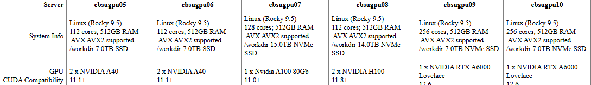

# Datasets

## Cornell University BioHPC Datasets

The BioHPC datasets provide **utilization, power, and temperature data** at **one-hour time resolution** for several machines operated by the BioHPC Lab at Cornell University. These datasets are used internally by the BioHPC Lab for modeling, analysis, and research purposes.

### Server Description

The list of servers included in the BioHPC datasets is shown below:



In the `biohpc-regression.py` file, which is used within the workload simulation pipeline, we focus on the server **cbsugpu08**, which is equipped with an **NVIDIA H100 GPU**.

---

## NSRDB 2024 City Temperature Datasets

These datasets are used in the `app_coppue.py` application to assess the relationship between **Coefficient of Performance (COP)** and **Power Usage Effectiveness (PUE)** under different weather scenarios, assuming **free cooling technologies**.

The **National Solar Radiation Database (NSRDB)** provides solar, temperature, and weather data for selected U.S. locations. The datasets used here are intended for **research and simulation purposes**, particularly for modeling data center energy workloads and environmental impacts.

### Data Source

The datasets were downloaded using the **NSRDB Data Viewer**:

https://nsrdb.nrel.gov/data-viewer

### Dataset Selection Parameters

When downloading the datasets from the NSRDB Data Viewer, the following options were selected:

- **Dataset:** USA & Americas (30, 60 min / 4 km / 1998–2024)
- **Attributes:** Temperature only  
  (temperature is assumed to be the primary weather variable influencing cooling systems)
- **Selected Year:** 2024
- **Selected Interval:** 30 minutes
- **Leap Day:** Excluded

### File Naming Convention

Each CSV file must follow the naming format: 
`nsrdb_city_2024.csv`

where `city` is the lowercase city name with no spaces.  

Example: `nsrdb_chicago_2024.csv`


### Datasets Included

In the `app_coppue.py` application, the following datasets are used:

- `nsrdb_chicago_2024.csv`
- `nsrdb_losangeles_2024.csv`
- `nsrdb_memphis_2024.csv`
- `nsrdb_miami_2024.csv`
- `nsrdb_newyork_2024.csv`
- `nsrdb_saltlakecity_2024.csv`
- `nsrdb_seattle_2024.csv`

---

### Other Usage

These datasets can also be used for:

- Simulation of data center workloads under varying temperature conditions  
- Energy modeling and optimization  
- Climate analysis and research  

#### Example (Python)

```python
import pandas as pd

# Load Chicago dataset
df = pd.read_csv("nsrdb_chicago_2024.csv")
print(df.head())


